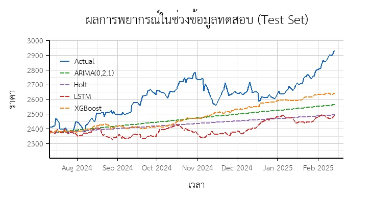

# Summary of Results

We compared the forecasting performance for gold prices during the Russia-Ukraine war using

2 Time Series methods

- Holt's Exponential Smoothing
- ARIMA (0,2,1) from the ARIMA approach

and 2 Machine Learning methods

- XGBoost
- LSTM

We used RMSE, MAPE, and MAD(MAE) as the error metrics to evaluate forecast accuracy. For all three metrics, a value closer to 0 means better performance (lower error).

| Model         |       RMSE |        MAD |  MAPE(%) |
| :------------ | ---------: | ---------: | -------: |
| Holt's        |     210.53 |     186.17 |     6.95 |
| ARIMA         |     173.18 |     151.26 |     5.64 |
| **_XGBoost_** | **156.49** | **132.55** | **4.95** |
| LSTM          |     246.58 |     221.61 |     8.29 |

- The best forecasting method was XGBoost, followed by ARIMA(0,2,1), Holt's, and LSTM, respectively. This was different from the initial hypothesis that LSTM would perform the best. The reason might be that the dataset was too small, which could make it difficult for a deep learning model to learn the patterns effectively.

- However, none of the methods gave really satisfying results. Looking at the forecasted values, all methods could only predict the general trend. Throughout the test period, the actual and predicted values still differed by hundreds of dollars. This problem could possibly be solved by adding external variables, such as highly correlated assets or other economic indicators. For example, we could use the ARIMAX model (an ARIMA model that allows external factors) or add more features to the Machine Learning models, which might improve the forecasting performance.

- During the Validation step, the best model was XGBoost with an RMSE of around 97, but in the actual forecasting it got an RMSE of 156.49. This shows that the data pattern changed during the test period, making it harder to forecast.

- When we tried different hyperparameter search ranges for XGBoost, the accuracy did not change much. On the other hand, for LSTM, when we used the best parameters from different search rounds to build the model and evaluate on the test set, the results varied a lot. Sometimes the model was very accurate (the most accurate among all 4 methods), but other times it was very inaccurate (the worst among all 4 models). This means that the LSTM model is very sensitive to hyperparameters. This is probably because deep learning models generally need a large amount of data, while XGBoost showed stable accuracy even when changing the hyperparameter search range, possibly because even though the data was small, it was enough to train the model.
